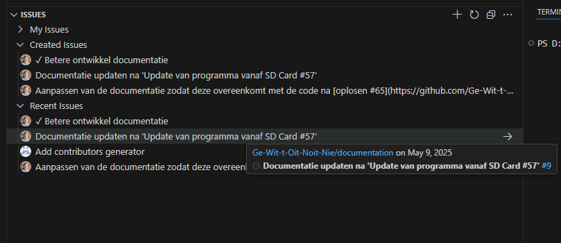
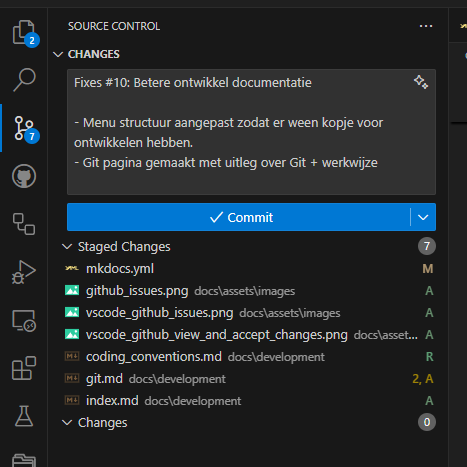
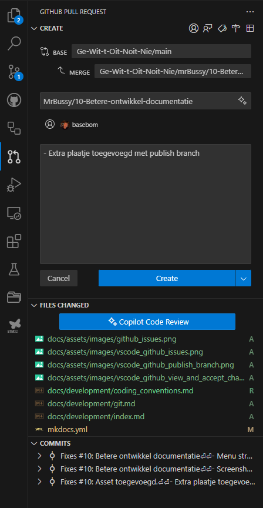
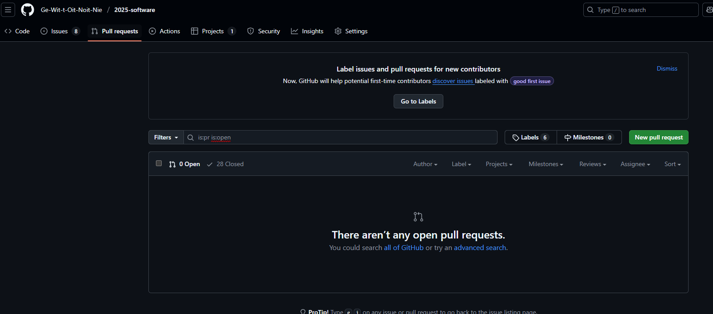

# Git en GitHub

Voor het ontwikkelen van de software en documentatie wordt gebruik gemaakt van [Git](https://git-scm.com/) met [GitHub](https://github.com/Ge-Wit-t-Oit-Noit-Nie). Door gebruik te maken van Git wordt de collaboratie beter en zijn er minder problemen met de versie.

## Standaard afspraken

Om goed met git te werken, is het wel nodig een aantal afspraken te maken. De volgende lijst is een (korte) samenvatting:

* (MUST) Iedere nieuwe wens, bug of idee wordt ontwikkeled op een "feature" branch.
* (MUST) Wanneer de feature klaar is, dan wordt deze middels een **pull-request** aangeboden aan een 2de set ogen.
* (MUST) Het is niet toegestaan direct op de "main" branch wijzigingen te maken.
* (SHOULD) Iedere branch heeft een of meerdere "issues" op Github die de wijziging beschrijven.

## Github issue overzicht en aanmaken

Wanneer er een nieuwe wens is, of er een bug is, dan wordt er een *issue* aangemaakt in github bij het betreffende project. Indien gebruik gemaakt wordt van Github, dan kan dit in de issue tabblad:


Tevens kan gebruik gemaakt worden van een [extentie](https://marketplace.visualstudio.com/items?itemName=GitHub.GitHubExtensionforVisualStudio) in [VSCode](https://visualstudio.microsoft.com/):



### Minimale gegevens

Het is belangrijk dat de issue minimaal de volgende gegevens heeft:

* Titel
* In geval van bug: Wat is er gebeurt om het probleem te krijgen en wat is de verwachting
* In alle andere gevallen: Wat is het gewenste gedrag / informatie nadat het issue afgehandeld heeft

## Workflow

De volgende workflow wort aangeraden voor het maken van wijzigingen.

### Feature branch maken

Indien je een issue wil oppaken, dan kan in VSCode naast het issue op de pijl naar rechts geklikt worden. Dit maakt lokaal een nieuwe branch aan die als volgt genoemd is: \[ID\]-\[Titel\].

Hierbij wordt **ID** vervangen door het nummer van het issue. **Titel** is uiteraard de titel van het issue. Door deze naamgeving wordt het volgen van de branches iets eenvoudiger aangezien het ID van issue herleidbaar is.

!!! note "Opmerking"
    Bij het documentatie project, wordt gebruik gemaakt van *ID-Titel* als identifier voor een feature branch.
    Bij de repository *2025-software* wordt gebruik gemaakt van *feature/ID-Titel*. Dit heeft verder geen invloed, maar het idee is dat je *feature* kan vervangen voor *bug* zodat het iets zichtbaarder is wat voor een wijziging gedaan is

### Code commit

Nadat je de wijzigingen doorgevoerd hebt, kan je de gewijzigde bestanden inchecken:



Bij het inchecken van de wijzigingen, moet er een omschrijving opgegeven worden. In de eerste regel, gebruik maximaal 80 tekens om aan te geven waar de wijziging voor staat. Bijvoorbeeld *Fixed \#63: Refactor program_controller.c/.h* geeft aan dat er een bestand herschreven is wat onderdeel is van issue 63.

Vervolgens kan je een lege regel laten en uitgebreid beschrijven wat er gewijzig is. Een volledige commit heeft dan de volgende inhoud:

```text
Fixes #10: Betere ontwikkel documentatie 

- Menu structuur aangepast zodat er ween kopje voor ontwikkelen hebben.
- Git pagina gemaakt met uitleg over Git + werkwijze
```

Hierbij zie je dat er een aanpassing is geweest die een aanpassing doet op \#56. Ook is beschreven waarom en wat er gewijzigd is.

!!! tip "Tip"
    Je schrijft de codecommit bericht voor iemand die wellicht niet weet wat de wijziging inhoud. Het is dus van belang dat de ontvangende partij moet snappen wat er gebreurt.

Nadat de aanpassing klaar is, kan je alle wijzigingen publiceren door de feature branch te pushen naar Github. Daarna kan je een [pull request](#pull-request) aanmaken.


## Pull request

Wanneer je een of meerdere wijzigingen doorgevoerd hebt, en je bent klaar, dan ga je een pull request aanmaken. Dit kan vanuit VSCode, maar ook online.


Het is belangrijk dat je de pull request doorzet naar iemand anders die dan de wijzigingen kan controleren en eventueel accepteren.



Na het invullen van een goede beschrijving, kan je op create clicken en zal de pull request doorgezet worden. Bij het invullen kan er voor gekozen worden alvast een "Assignee" toe te voegen. Hiervoor dien je op het rond omcircelde knopje te drukken.


`

!!! tip "Tip"
    Als je in dit scherm fouten maakt of iets vergeet en je hebt al op "Create" gedrukt, dan kan je altijd online nog aanpassingen maken. Ga hiervoor naar het pull requests scherm.
    


