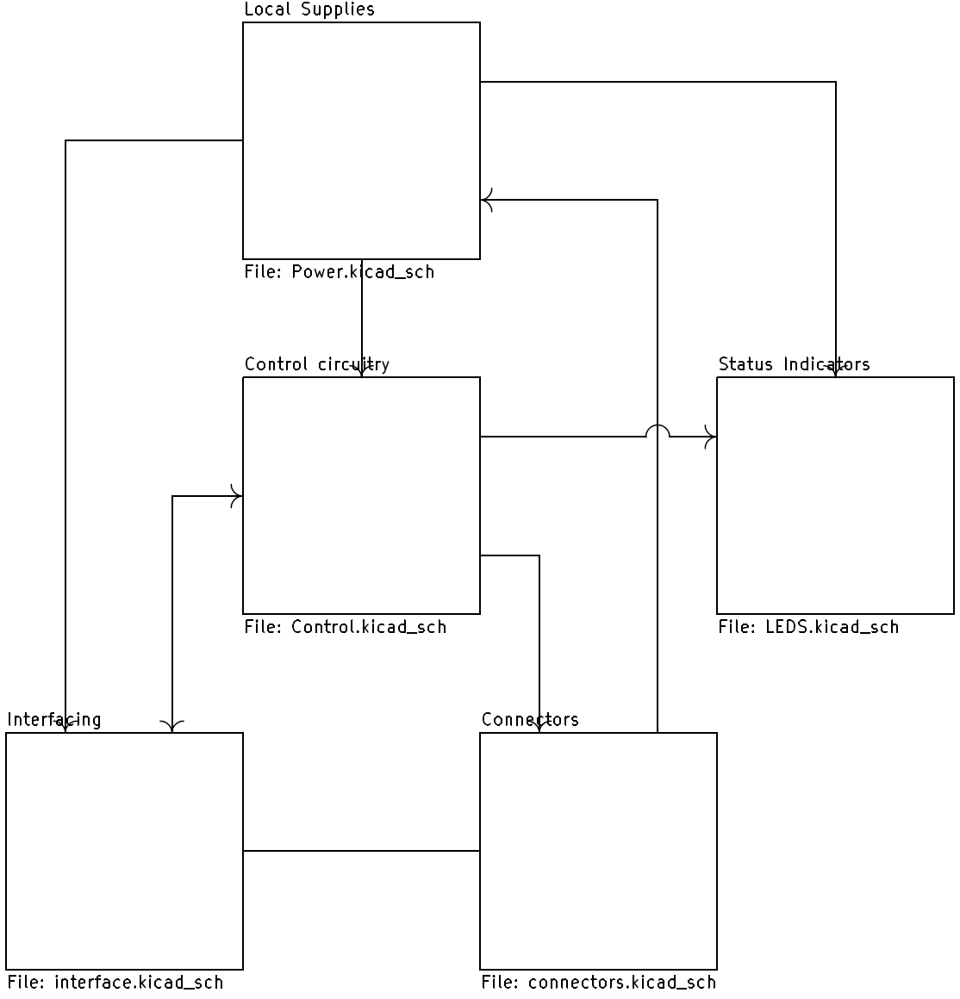
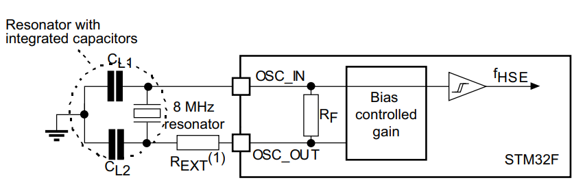
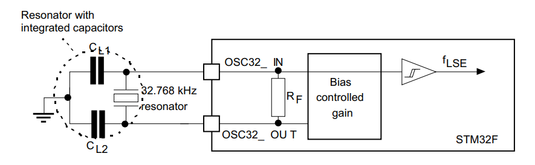
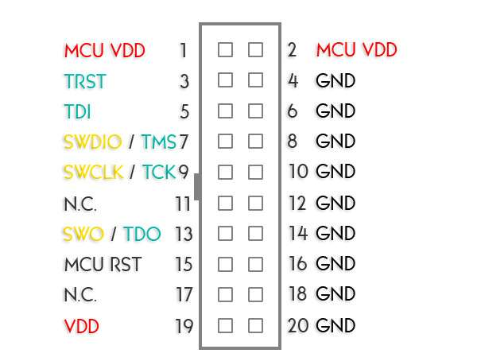

# Ontwerp programma hardware

## Printplaat

Voor het ontwerp van de printplaat word gebruik gemaakt van het gratis programma
[KiCAD](https://www.kicad.org/). Dit is een printplaat ontwerp programma met
ruime functionaliteit die voldoet aan al onze eisen. Een handleiding hiervoor
staat in het engels beschreven in [deze link](https://greendome.tech/wp-content/uploads/2025/03/PCBGuide.pdf).

## Schema

De volgende tekening is een schematische weergave van microcontroller aansluiting
op de printplaat.

Bij projecten groter dan 10 componenten moeten subsheets gebruikt worden zoals te zien in onderstaande afbeelding. Alle connecties tussen sheets zullen met lijnen verbonden worden en met peilen aangegeven worden om de richting van data/stroomverkeer aan te geven.

Indien er onderscheid tussen componentgroepen gemaakt moet worden moet dit binnen een sheet gebeuren zoals te zien in onderstaande afbeelding. Om losse componentgroepen te onderscheiden zullen er grensgebieden om de componentgroepen komen waarin de naam van de groep staat.

Deze conventies zorgen voor een makkelijk te lezen en aan te passen schema.

Er zal een polariteit geimplementeerd worden op de printplaten zodat componenten niet verkeerd ingestoken kunnen worden. Dit kan gedaan worden door asymmetrische connectoren te gebruiken of meerdere connectoren te gebruiken die asymmetrisch geplaatst zijn (hoek van 90 °, plaatsing schuin tegenover elkaar).
## Technische specificatie

De microcontroller die gekozen is voor het project is de **STM32F412RGT6** van
ST Microelectronics. Deze chip heeft genoeg ruimte en besturingsmogelijkheden om
voldoende programma's van komende jaren met gemak te kunnen draaien. Daarnaast
bevat deze chip meerdere communicatiemogelijkheden die in de toekomst gebruikt
kunnen worden.

[Download datasheet](../assets/pdf/stm32f412rg.pdf)

## Klokken van de microcontroller

Een klok binnen een microcontroller zorgt voor coordinatie van vercheidene operaties.
Er kunnen per microcontroller meerdere klokken gebruikt worden, binnen dit project
worden er twee gebruikt.

### Hoge Snelheids Extern kristal (HSE)

Voor het Hoge Snelheids Extern kristal (HSE) word momenteel een 8 MHz resonator
gebruikt. Deze zijn niet duur en bieden meer precisie dan de ingebouwde RC klok.
Een standaard integratie is te zien in de hieropvolgende afbeelding.

Meer informatie over een fatsoenlijke layout en integratie is te vinden in AN2867
“[Oscillator design guide for ST microcontrollers](https://www.st.com/resource/en/application_note/an2867-guidelines-for-oscillator-design-on-stm8afals-and-stm32-mcusmpus-stmicroelectronics.pdf)",
beschikbaar via de website van ST-Microelectronics.

Mocht er gekozen worden voor het gebruik van de interne clock, kan de plaatsing
van de relevante componenten tijdens de print assemblage overgeslagen worden.
Stel dat de klok het niet doet na verandering van het component kan eventueel de
externe weerstand (REXT in bovenstaande afbeelding) naar 0 Ω gezet worden.

#### Huidig component in gebruik

Momenteel word gebruik van de *Kitelco 8 MHz SX-1T&RC16* gemaakt. Dit is een 8
MHz resonator met aan weerskanten laad condensatoren van 16 pF, die zorgen voor
verbeterde stabiliteit van het signaal. Daarnaast is de externe weerstand
(REXT in bovenstaande afbeelding) berekend op 1.2 kΩ via sectie 3.5.3
van AN2867.

Indien dit in de toekomst verandert moet er opnieuw via de datasheet van het
nieuwe component gekeken worden naar de laad condensatoren en naar de externe
weerstand.

### Real-Time Clock kristal (RTC)

Voor de RTC is een externe clock gewenst en in gebruik, omdat deze meer precisie
bied qua dingen die op tijd basis gaan. Deze moet een frequentie hebben van
32.768 kHz, wat een industrie standaard is. Hieronder is een standaard integratie
weergegeven.

 Meer informatie over een fatsoenlijke layout en integratie is te vinden in
 AN2867 “[Oscillator design guide for ST microcontrollers](https://www.st.com/resource/en/application_note/an2867-guidelines-for-oscillator-design-on-stm8afals-and-stm32-mcusmpus-stmicroelectronics.pdf)",
 beschikbaar via de website van ST-Microelectronics.

#### Huidig component in gebruik

Momenteel word gebruik van de *YIC 32.768K12.5PI/MC306* gemaakt. Dit is een
32.768 kHz resonator met aan weerskanten laad condensatoren van 7 pF, die zorgen
voor verbeterde stabiliteit van het signaal.

Indien dit in de toekomst verandert moet er opnieuw via de datasheet van het
nieuwe component gekeken worden naar de laad condensatoren.

!!! info "LET OP"
    Dit component heeft een niet standaard footprint in KiCAD. Pas de footprint van het component aan binnen KiCAD.

## Programmeren via SWD

Voor het programmeren van de STM32 word een STLINK/V2 gebruikt.
Deze heeft de volgende pinconfiguratie beschikbaar:

Voor het programmeren van de microcontroller moeten de volgende pinnen
aangesloten zijn op de volgende manier:

1. GNDSTLINK naar GNDSTM32
2. VDDSTLINK naar 3V3STM32
3. SWDIOSTLINK naar SWDIOSTM32
4. SWCLKSTLINK naar SWCLKSTM32
5. MCU VDD STLINK **(ookwel VDUT genoemd)** naar 3V3STM32

### Externe voeding

Indien de STLINK/V2 op zichzelf niet genoeg stroom levert kan er een externe
voeding gebruikt worden in combinatie met de hierbovenstaande pinconfiguratie.

!!! danger "Waarschuwing"
    Sluit niets met een spanning hoger dan 3.3 V aan op de 3V3 poort, dit kan
    schade aan de basismodule of STLINK toebrengen! Verifieer dit voor het
    aansluiten met een multimeter.

#### Voeding van 5 V tot 30 V

De positieve pool van deze voeding moet aangesloten worden op de VIN pin en de
negatieve pool op de GND pin. Beide pinnen zijn te vinden op de normale
snelheidsbus (Regular I/O). De desbetreffende pinnen zijn te vinden onder het kopje
[Hardware](../gwtonn_hardware/piggyback.md).

#### Voeding van 3.3 V

De positieve pool moet op een van de 3V3 pinnen terecht komen via de voeding zelf
of het STM32 bord. De negatieve pool kan verbonden worden met een GND pin op de
basismodule of de STLINK/V2. Deze pinnen zijn op de basismodule gemarkeerd.

### Huidige programmeertool STLINK/V2 + Piggyback Module
Om het programmeergemak te verhogen en risico op foutieve aansluitingen te verkleinen is er een printplaat ontwikkeld die een makkelijke connectie vormt tussen de STLINK/V2 en de piggyback module. Deze is te zien in onderstaande afbeelding.

#### Andere programmers
Om voor andere programmeerbare bordjes ook te voorkomen dat het foutief aangesloten word zullen voor deze bordes een op maat gemaakte programmer ontworpen worden. 