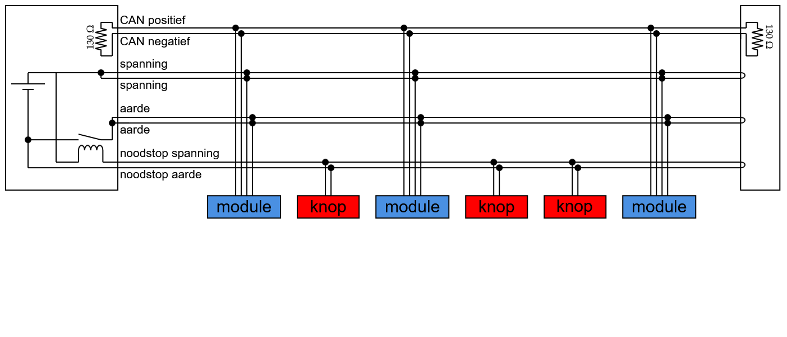

# Bus architectuur
Er is voor een bus architectuur gekozen waarbij alle benodigde draden in een kabel gecombineerd zijn. Een bus architectuur gebruikt minimale bekabeling waarbij alle apparaten in een lijn aan elkaar zitten met een kop aan de ene kant en een staart aan de andere kant, zoals te zien is op de afbeelding hieronder. Hiervoor is gekozen zodat er zo min mogelijk losse kabels door de wagen gaan.

Deze bus architectuur is galvanisch geisoleerd tot alle individuele modules tot 2 kV, waardoor een module die aan de bus hangt catastrofaal kan falen zonder de rest van het netwerk mee te nemen.

## Fysieke laag
De fysieke aansluiting van de bus is een CAT-5 kabel met RJ45 (ookwel 8P8C) connectoren. Over deze kabel gaan de volgende signalen:

- CAN
- Spanning
- Noodstop

De draad functies worden hieronder gegeven.

| **Draadnummer** 	| **Kleur**  	| **Functie**       	|
|-------------------|---------------|-----------------------|
| 1               	| wit/groen  	| CAN positief      	|
| 2               	| groen      	| CAN negatief      	|
| 3               	| wit/oranje 	| Noodstop positief 	|
| 4               	| blauw      	| Spanning            	|
| 5               	| wit/blauw  	| Spanning          	|
| 6               	| oranje     	| Noodstop negatief 	|
| 7               	| wit/bruin  	| Aarde             	|
| 8               	| bruin      	| Aarde             	|

## Aansluitingen

### CAN
CAN is een automotive communicatie standaard die bekend staat om zijn robuustheid. Het heeft een positieve en negatieve draad nodig die het liefst een twisted pair vormen voor signaalintegriteit. De negatieve draad heeft het omgekeerde signaal van de positieve draad.

| **Bitwaarde** 	| **CAN positief**  	| **CAN negatief**       	|
|-------------------|-----------------------|---------------------------|
| 1 (Recessief)   	| 5 V                	| 0 V                    	|
| 0 (Dominant)    	| 0 V                	| 5 V                    	|

## Spanning
De CAN bus is een bepaald hardware protocol en heeft een aansturing chip nodig. De CAN bus is galvanisch geisoleerd van alle modules en heeft hierdoor een aparte spanning nodig. Deze spanning word over twee twisted pairs gestuurd van de CAT-5 kabel.

### Noodstop
De noodstop is geimplementeerd met twee kabels, spanning en ontvanger. Op de kop van de bus wordt een spanning gecreëerd, die de hele bus op en neer gaat, om vervolgens in de kop zelf een relais aanstuurt. Alle noodstoppen staan in serie met elkaar, wat betekent dat als er een wordt ingedrukt, de stroomkring onderbroken wordt. Hierdoor opent de relais die de modules uitschakelt.
De noodstoppen zijn verspreid over heel de wagen.