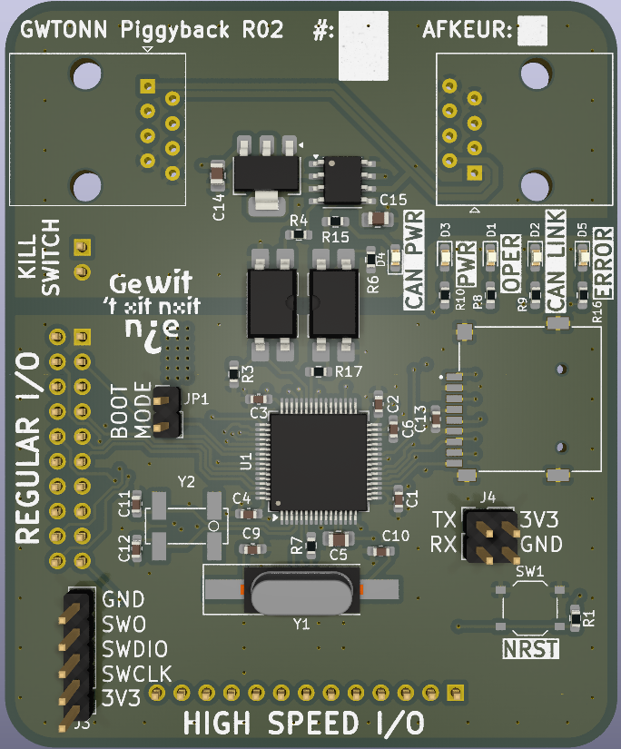

# Basismodule Handleiding
Er is gekozen om een generieke basismodule te maken die voor de meeste applicaties geschikt is. Dit is gedaan om kosten te besparen en programmeergemak te creëren. Hieronder bevind zich informatie over deze basismodule en wat er beschikbaar is. Dit bord zal op een draagbord komen wat alle functies daadwerkelijk uitvoert.

## Benaming
Bovenaan de basismodule staan de naam en revisie (Hier "GWTONN Piggyback R02") gevolgd door een wit vlak om aan te geven welk nummer het is qua bordje. Mocht er iets kapot zijn aan het bordje kan dit gemarkeerd worden met watervaste stift in het "AFKEUR" vakje. Als dit vakje een andere kleur heeft dan wit mag deze niet op de wagen gebruikt worden.

### Microcontroller
De microcontroller is het brein van de hardware. Deze chip voert alle code uit en zorgt dat alle taken gesynchroniseerd uitgevoerd worden. Deze is verantwoordelijk voor bijvoorbeeld lichten precies te schakelen of motoren te laten bewegen.

### Status LEDs
Op de basismodule zijn vijf LEDs beschikbaar die ieder een andere functie hebben zoals weergegeven in de tabel hieronder.

| **LED**      | **Kleur** | **Functie**                                              |
|----------|-------|------------------------------------------------------|
| CAN PWR  | Groen | Geeft aan of de CAN bus stroomtoevoer heeft          |
| PWR      | Groen | Geeft aan of de basismodule stroomtoevoer heeft      |
| OPER     | Blauw | Geeft aan of de basismodule werkt en operationeel is |
| CAN LINK | Blauw | Geeft aan of de CAN bus werkt                        |
| ERROR    | Rood  | Geeft aan als iets fout gaat op de basismodule       |

### Ingangen en Uitgangen
De basismodule beschikt over twee RJ45/ethernet connectoren om te communiceren met de hoofdmodule en andere basismodules. Daarnaast beschikt dit bord over een normale uitgangsbus (Regular I/O / RIO) en een over hoge snelheidsbus (High Speed I/O / HSIO). Deze uitgangen zijn onder een hoek van 90 graden van elkaar neergezet om te voorkomen dat deze verkeerd om in het draagbord gestoken kan worden. De pin nummeringen zijn weergegeven op de printplaat.

Daarnaast beschikt de basismodule over de "KILLSWITCH" pinnen. Deze zorgen ervoor dat alle stroom direct van de borden af wordt gegooid als de noodstop ingeduwd wordt.

Elk van de pinnen van de normale, en hoge snelheids bus zijn afzonderlijk te besturen. Specifieke pinnen op de bussen kunnen een secundaire functie aanbieden, deze functies zijn te vinden in de datasheet van [ST Microelectronics](https://www.st.com/resource/en/datasheet/stm32f412ce.pdf).

De "BOOT MODE" jumper zorgt ervoor dat de basismodule in primaire of secundaire modus opstart, het verschil hiertussen staat beschreven in de GWTONN Bibliotheek.

Er zit ook een microSD kaart lezer op de basismodule. Deze zal het draaiprogramma bevatten en een log schrijven over wat er allemaal gebeurt. De log kan gebruikt worden als evaluatie om te kijken wat er goed en slecht gaat.

De reset knop is bedoeld voor tijdens het programmeren of in geval van ernstige fouten die eventueel op te lossen zijn door opnieuw opstarten.

#### Programmeer/Uitlees ingangen en uitgangen
De basismodule bevat een SWD interface (Serial Wire Debug) waarmee de basismodule geprogrammeerd kan worden. Deze interface is te herkennen door de volgende pinnen:

1. GND
2. SWO
3. SWDIO
4. SWCLK
5. 3V3

Hier zijn de 3V3 en GND de 3.3 V voedings pinnen.

Als uitleesbus is er in het geval van fouten een UART bus toegevoegd, deze is softwarematig in te stellen naar wens en is te herkennen aan de volgende pinnen:

1. TX
2. RX
3. 3V3
4. GND

Hier zijn de 3V3 en GND de 3.3 V voedings pinnen.

#### Hoge snelheidsbus
De pinnen van de microcontroller die gekoppeld zijn aan de hoge snelheidsbus zijn als volgt:

| HSIO Pin | Microcontroller pin |
|----------|---------------------|
| 0        | PC0                 |
| 1        | PC1                 |
| 2        | PC2                 |
| 3        | PC3                 |
| 4        | PC4                 |
| 5        | PC6                 |
| 6        | PC7                 |
| 7        | PC8                 |
| 8        | PC9                 |
| 9        | PC10                |
| 10       | PC11                |
| 11       | PC12                |
| 12       | PC13                |

#### Normale snelheidsbus
De pinnen van de microcontroller die gekoppeld zijn aan de normale snelheidsbus zijn als volgt:

| RIO Pin | Microcontroller pin |
|---------|---------------------|
| 0       | PA0                 |
| 1       | PA1                 |
| 2       | PA2                 |
| 3       | PA3                 |
| 4       | PA8                 |
| 5       | PA11                |
| 6       | PA12                |
| 7       | PA15                |
| 8       | PB2                 |
| 9       | PB4                 |
| 10      | PB5                 |
| 11      | PB6                 |
| 12      | PB8                 |
| 13      | PB9                 |
| 14      | PB12                |
| 15      | PB13                |
| 16      | PB15                |

### Communicatie
De hoofdcommunicatie tussen borden die over heel de wagen verspreid zijn word is een CAN bus. Dit is een robuuste comunicatiebus die onder andere gebruikt word in auto's. Deze bus is elektrisch geisoleerd van de rest van de basismodule. Dit is gedaan omdat in het geval er een andere basismodule catastrofaal beschadigd niet alle bordjes beschadigen. Meer informatie over het gebruik van de bus is te vinden onder het kopje [Busarchitectuur](bus.md).
