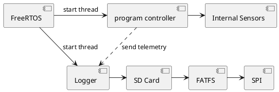

# Ge Wit't Oit Noit Nie bibliotheek

Om het overzichtelijk te houden, is er een losse bibliotheek gemaakt voor Ge Wit't Oit Noit Nie. De bibliotheek is te vinden in `{workspace}/Middlewares/gwtonn`.

## FreeRTOS

Als basis wordt gebruik gemaakt van [FreeRTOS (CMSIS v2 implementation)](https://arm-software.github.io/CMSIS-FreeRTOS/latest/index.html). Verdere details zijn te vinden op deze pagaina: [https://arm-software.github.io/CMSIS-FreeRTOS/latest/index.html](https://arm-software.github.io/CMSIS-FreeRTOS/latest/index.html)

## Programma controller

Voor het uitvoeren van de programma, is er een programma controller. De details staan beschreven in [programma](programma_controller.md).

## Logger

De `logger` implementeerd functionaliteiten om een log te schrijven op een SD kaart (Via de SPI Interface). Omdat schrijven via de SPI naar SD enige tijd kan duren, wordt deze logger in een separate thread gestart. Deze thread kan voorzien worden van informatie via een message queue. 

!!! note "Note"
    De `void start_logger(void *argument)` is geimplementeerd in the bilbiotheek. De functie is `__weak` gemaakt in `freertos.c`. Om dit te laten werken, is in de STM32CubeMX programma een FreeRTOS taak gemaakt met de naam **logTask** en de functie `start_logger`. De **Code Generation Option** is ingesteld op **As Weak**.

Voor details over de logger, kijk in de hoofdstuk over de [logger](logger.md).

## FatFS met de SD Card Controller via SPI

Om bestanden te kunnen maken op een SD kaart, gebruiken we een SD Card reader. Deze wordt aangesloten via een SPI Interface met de Nucleo board. Vervolgens gebruiken we de FatFS library om een bestandsysteem te simuleren.

De FatFS staat aangemerkt als `USER_Driver` in STM32CubeMX. Deze userdriver is gedefineerd in [user_diskio.h](https://github.com/Ge-Wit-t-Oit-Noit-Nie/2025-software/blob/625d55744113268ce4867d9d272ac160e8ca30f1/FATFS/Target/user_diskio.h) en geimplementeerd in  [user_diskio.c](https://github.com/Ge-Wit-t-Oit-Noit-Nie/2025-software/blob/625d55744113268ce4867d9d272ac160e8ca30f1/FATFS/Target/user_diskio.c).

De vertaalslag van de FATFS implentatie naar SPI commando's gebeurt in [user_diskio_spi.c](https://github.com/Ge-Wit-t-Oit-Noit-Nie/2025-software/blob/feature/57-Update-van-programma-vanaf-SD-Card/Middlewares/gwtonn/src/user_diskio_spi.c).
