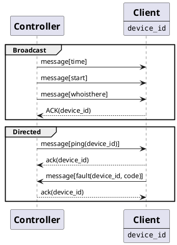

# CAN

Voor de communicatie tussen de verschillende borden, wordt gebruik gemaakt
van het CAN protocol.

## Sequence diagram

### Type bericht

Zoals zichtbaar in de sequence diagram, zijn er 2 soorten berichten

- **Broadcast**: Dit bericht is voor iedereen bestemd.
- **Directed**: Dit bericht is specifiek voor een bord.

## CAN bericht

Ieder bericht volgt een vast patroon:

- BERICHT_CODE (1 BYTE)
- (OPTIONEEL) BOARD_ID
- DATA (0-x BYTE)
- TERMINATION (0xFF, 0xFF, 0xFF)

## Bericht specificatie

Ieder bericht heeft een specifieke code. In dit hoofdstuk wordt
de specificatie van ieder bericht gegeven.

### TIME

Het tijd bericht verstuurd de actuele clocktijd. Dit bericht kan
gebruikt worden om de RTC te corrigeren.

| Type bericht | Bericht code | Data         |
| ------------ | ------------ | ------------ |
| BROADCAST    | 1            | encoded_time |
