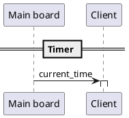
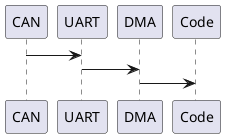

# CAN

Voor het communiceren tussen de verschillende componenten (piggybags) wordt
gebruik gemaakt van de CAN bus. In de firmware wordt deze ontsloten en benaderd als
```UART1```.

## Protocol

CAN is de hardware matige connectie tussen 2 or meer componenten. Voor de software
hebben we een protocol gemaakt. Deze is als volgt:



Voor de protocol wordt gebruik gemaakt van een standaard berichtformaat:

| BYTE   | Waarde     | Omschrijving |
| --     | ---        | ---          |
| 1      | CODE       | Een code de signaleerd wat het bericht is |
| 1..9   | Content    | De inhoud van het bericht |
| 10..12 | Terminator | 0xFF, 0xFF, 0xFF --> Einde bericht indicator |

Zoals zichtbaar in de tabel bestaad een bericht altijd uit *12 bytes*.
Hiervoor is gekozen om het eenvoudig te maken om een bericht te ontvangen.

## Gebruik van DMA

Een bericht vanaf de CAN bus wordt via een **DMA** stream doorgezet 
naar het geheugen voor verwerking.



De keuze van het gebruik van DMA is vrij simpel:
Dit garandeerd de aankomst van berichten. Het vullen van geheugen
via DMA gebeurt buiten de CPU om en is daarmee veel sneller.

## Berichten

De berichten die op dit momement beschikbaar zijn staan in dit hoofdstuk.

### MESSAGE_CODE_TIME

De **MESSAGE_CODE_TIME** bericht is een *broadcast* bericht. Dit bericht
wordt verstuurd door de controller board en wordt door iedereen ontvangen.
Het bericht stuurd de actuele tijd en kan gebruikt worden om de klokken
op elkaar af te stemmen.

De tijd wordt verstuurd als 17 bits en heeft een specifieke compressie.
Gebruik de functie ```dt_decode(encoded_time, &decoded_time);``` om de 
tijd te decoderen.

#### Voorbeeld

De volgende implementatie kan de tijd ontcijferen en de klok zetten.

Hierbij is *uartRxBuf* de buffer die gevult wordt door de *DMA*.  

```c
// cast 8 bytes from the buffer to a uint64_t
encoded_time = (dt_dense_time)uartRxBuf[1] << 56 |
               (dt_dense_time)uartRxBuf[2] << 48 |
               (dt_dense_time)uartRxBuf[3] << 40 |
               (dt_dense_time)uartRxBuf[4] << 32 |
               (dt_dense_time)uartRxBuf[5] << 24 |
               (dt_dense_time)uartRxBuf[6] << 16 |
               (dt_dense_time)uartRxBuf[7] << 8 |
               (dt_dense_time)uartRxBuf[8];

datetime_t decoded_time = {0};
dt_decode(encoded_time, &decoded_time);
is_set_time(
     decoded_time.hour, decoded_time.minute,
     decoded_time .second); // Set the time in the internal sensors module
is_set_date(
     .year, decoded_time.month,
     decoded_time.day); // Set the date in the internal sensors module


void HAL_UART_RxCpltCallback(UART_HandleTypeDef *huart) {
    if (huart->Instance == USART1) {
        HAL_GPIO_WritePin(GPIOB, GPIO_PIN_7,
                          GPIO_PIN_SET); // Set a pin to indicate activity

        uart_rx_received = true;

        HAL_GPIO_WritePin(GPIOB, GPIO_PIN_7,
                          GPIO_PIN_RESET); // Set a pin to indicate activity
        // Restart interrupt for next byte
        HAL_UART_Receive_DMA(&huart1, uartRxBuf, UART_RX_BUF_SIZE);
    }
}
```
