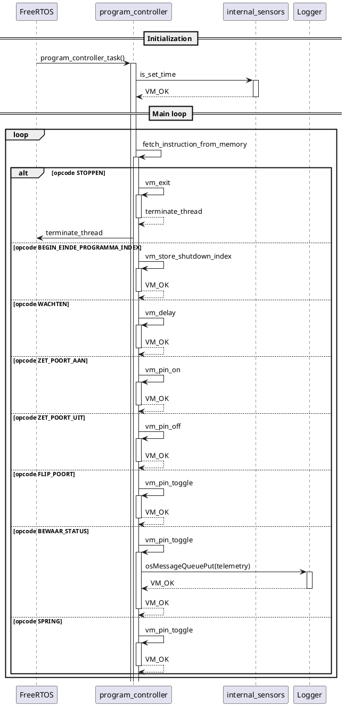

# Programma

Het hele idee van de controller is om een progarmma uit te voeren.
Op deze pagina beschrijven hoe dit werkt.

## Programmeren

Voor het programmeren is een eigen ontwikkeltaal gemaakt. Deze hier beschreven:
[programma speccificatie](../gpc/program_specifications.md).
Na het programmeren moet het programma gecompileerd worden.

Na het compileren moet de programma geschreven worden in het geheugen.
Dat kan op 2 manieren zoals beschreven in de volgende paragrafen.

## Programma laden in de firmware

De eerste methode is het laden van het programma in de firmware.
In basis kan hiervoor de volgende stappenplan gevolgt worden:

1. Schrijf een programma.
2. Compileer het programma met de [gpc](../gpc/index.md)
3. Copieer het bestand dat gemaakt is als output naar de root van de firmware folder
   1. Zorg er voor dat het programma ```binary_file.bin``` heet
4. Compileer en laad de firmware

## Programma laden via de SD Card

Een andere mogelijkheid is het laden van een programma via de SD Card.
Hiervoor dient een bestand met de name ```binary_file.bin``` in de root van
de SD Card staan. Volg de volgende stappen:

1. Schrijf een programma.
2. Compileer het programma met de [gpc](../gpc/index.md)
3. Copieer het bestand dat gemaakt is als output naar de root van een SD Card
   1. Zorg er voor dat het programma ```binary_file.bin``` heet
   2. de SD Card moet FAT32 geformateerd zijn
4. Herstart de STM32 piggybord.

## Werking van de controller

De controller kan gezien worden als een virtuele omgeving. We simuleren een hardware die verschillende instructies (OPCODES) kan uitvoeren.
Deze instructies staan in het geheugen en worden stuk voor stuk uitgevoerd. 


