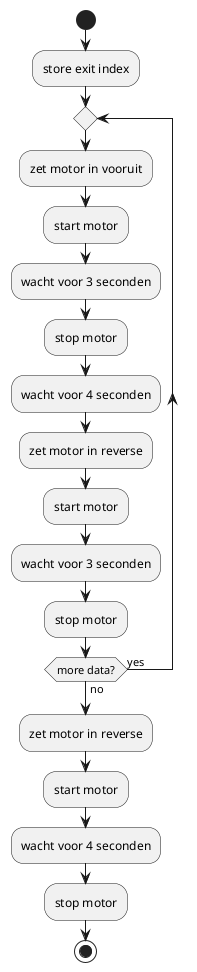

# Over 2025

Hier komt een beschrijving van de setup voor 2025.

## Hardware setup

!!! note
    Maak een schema met de verschillende componenten

### Component 1

### Component 2

## Programma

Beschrijf hier de programma die uitgevoerd moet worden in simpele stappen.

Voeg eventueel een tekening toe met uml:

